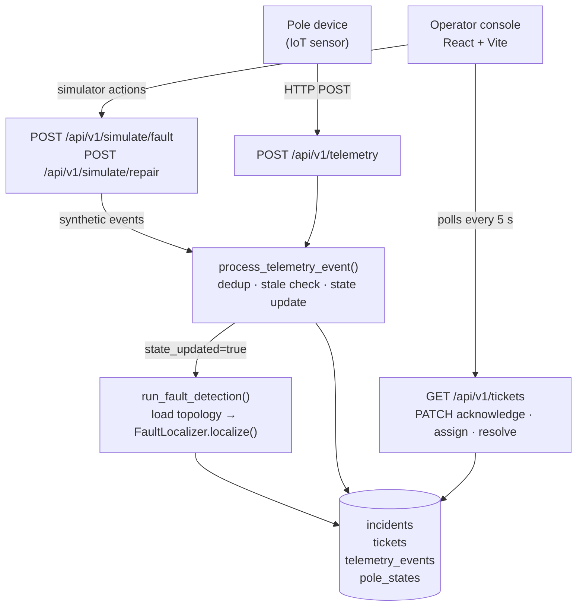

# Architecture

---

## Data flow



---

## Data sourcing and ingestion

### Telemetry events

The `POST /api/v1/telemetry` endpoint accepts one event per call:

```json
{
  "device_id": "D-000042",
  "pole_id": "P-000042",
  "event": "power_lost",
  "energized": false,
  "device_ts": "2026-08-04T10:00:00Z",
  "seq": 1001,
  "battery_mv": 3800,
  "rssi": -72,
  "firmware": "v1.4.2"
}
```

**Duplicate handling** — A unique index on `(device_id, seq, event, energized, device_ts)` blocks exact duplicates at the DB level. `INSERT … ON CONFLICT DO NOTHING` returns no row; the handler looks up the existing row and returns `is_duplicate: true` without re-processing.

**Staleness** — Before inserting, the handler reads `device_states.last_seq` for the device. If the incoming `seq` is not greater than the stored value, the event is flagged `is_stale: true`. Stale events are stored for audit purposes but do not update pole state.

**State update** — A non-duplicate, non-stale event determines pole state:
- `power_lost` → `dark`, confidence 0.95
- `heartbeat` with `energized=false` → `dark`, confidence 0.80
- anything else → `live`, confidence 1.0

`pole_states` is updated with an upsert. `device_states` is updated to record `last_seq`, firmware, RSSI, and last-seen time. Fault detection runs only when `state_updated=true`.

**Burst / out-of-order** — The `seq` field from the device acts as a monotonic sequence number. Out-of-order delivery within a burst is handled by the staleness check; whichever message with the higher `seq` arrives last wins.

**Adapting to production NB-IoT/MQTT ingestion** — The assignment's real transport is devices publishing over NB-IoT to an MQTT broker, not HTTPS POST. The dedup/staleness/state-update logic above (`process_telemetry_event`) already takes a parsed event, not an HTTP request, so it does not need to change. What changes is the front door: replace `POST /api/v1/telemetry` with a small MQTT consumer process that subscribes to a per-device or per-feeder topic (e.g. `kspdb/sd07/<device_id>/event`), parses each MQTT message into the same `TelemetryEventRequest` shape, and calls the same ingestion function. MQTT's own at-least-once delivery (QoS 1) maps directly onto the duplicate/staleness handling already in place — no new dedup logic is required, only a new transport adapter. The consumer would run as its own container so a broker outage does not affect the HTTP API or the operator console.

**Ingest capacity** — `run_fault_detection()` performs a full O(N) sweep over all poles on every state-changing event, executed synchronously inside the request. This is adequate for the demo's request volume (see performance measurements below) but does not scale to the full 39 msg/s steady-state fleet with per-event synchronous detection at higher pole counts. The two documented mitigations, neither implemented, are: batch ingestion (accept an array of events per HTTP/MQTT call and run one detection pass per batch instead of per event), and a debounce window before detection runs. See "No debounce timer is implemented" under Noise handling, and the performance measurements section for the throughput actually measured against the current single-event synchronous design.

---

## Storage and internal model

### Schema overview

```
feeders (id, substation_id, name)
  └── distribution_transformers (id, feeder_id, lat, lng, capacity_kva, households_served)
        └── poles (id, feeder_id, dt_id, lat, lng, seq_on_line, parent_pole_id,
                   pole_type, ward, pincode, device_id)
              └── topology_edges (dt_id, parent_pole_id, child_pole_id, source, confidence)

telemetry_events (device_id, pole_id, event, energized, device_ts, seq, …, is_duplicate, is_stale)
pole_states      (pole_id, state, confidence, last_event_at, last_heartbeat_at)
device_states    (device_id, last_seq, status, firmware, last_rssi, last_seen_at)

scheduled_outages (scope, target_id, start_at, end_at, reason)

incidents (incident_type, status, feeder_id, dt_id, upstream_pole_id, downstream_pole_id,
           lat, lng, pincode, affected_poles, confidence, confidence_reasons)
tickets   (incident_id, lifecycle_status, assigned_crew, operator_note,
           resolved_marked_at, verified_at)
ticket_events (ticket_id, event_type, actor, payload)
```

### Why this representation

**Topology as explicit edges** — `topology_edges` stores directed parent→child relationships with a `source` field (`known` or `inferred`) and a per-edge `confidence`. About 60 % of DTs lack recorded `seq_on_line` / `parent_pole_id` in the pole registry. For these, the synthetic generator infers a linear chain ordered by geographic distance from the DT and stores edges with `source='inferred'` and lower confidence. This lets the localization algorithm work on all DTs today while making uncertainty visible to the operator.

**Dual raw/state tables** — `telemetry_events` is an append-only audit log. `pole_states` and `device_states` hold current state only. Detection reads `pole_states`; audit and debugging read `telemetry_events`. This keeps detection fast regardless of event volume.

**Incidents separate from tickets** — An incident records the physical fault location; a ticket tracks the human workflow. One incident produces exactly one ticket. This allows the lifecycle (detect → acknowledge → assign → resolve → verify) to be managed independently of fault physics.

---

## Localization algorithm

### Entry point

`FaultLocalizer.localize(transformers, poles, edges, observations)` in `app/domain/localization.py`.

Complexity: O(N) in the number of poles, where N ≈ 5 000. Each pole is visited at most twice per detection run.

### Step 1 — Build distribution trees

`build_distribution_trees()` in `app/domain/topology.py` groups poles by DT, resolves parent→child edges from `topology_edges`, and builds an in-memory tree of `PoleNode` objects. Roots are poles with no parent edge.

### Step 2 — Feeder-level check

For each feeder, if all reporting poles across every DT are dark and there are at least two DTs and three observed poles, a feeder-level incident is created. This check runs before per-DT analysis so a single feeder fault does not generate dozens of individual DT tickets.

Confidence: 0.88 (fixed — all reporting sensors agree, but the feeder cable itself is not directly sensed).

### Step 3 — DT-level check

If every reporting pole under a DT is dark, a DT-level incident is created (the transformer itself or its supply line is the candidate fault).

Confidence: 0.90.

### Step 4 — Span-level check

For each DT that is not entirely dark, the algorithm walks every edge. If a parent pole is `live` and a child pole is `dark`, a span fault exists between them.

**Sensor-fault exclusion** — Before the walk, any pole that reports `dark` but has a live descendant is classified as a sensor fault (the device is offline but current is still flowing). Such poles are excluded from both the upstream and downstream roles in span detection.

Confidence formula:
```
confidence = min(upstream_edge_confidence, downstream_edge_confidence)
             capped at 0.96 for known topology, 0.72 for inferred
             further capped at min(upstream_obs.confidence, downstream_obs.confidence)
```

Reasons are stored as a JSON array on the incident so the operator can read them.

### Handling 60 % missing topology

For DTs whose pole ordering was not surveyed, the generator creates inferred edges sorted by distance from the DT. The localization algorithm treats these identically to known edges but the confidence cap of 0.72 signals uncertainty. The operator sees "Topology for this DT was inferred rather than recorded." in the confidence reasons.

### Simultaneous faults

Each fault is keyed by `(incident_type, feeder_id, dt_id, upstream_pole_id, downstream_pole_id)`. `run_fault_detection()` computes the full fault set on every call, then diffs against open incidents. New keys create incidents; keys present in open incidents but absent from the new set close them. Three simultaneous faults produce three independent incidents.

### Known failure cases

- **Silent sensors** — a pole with no telemetry has state `unknown` and is invisible to the localizer. A fault affecting only unmonitored poles will not be detected.
- **Partial feeder observation** — the feeder-level check requires all observed poles to be dark. If one working sensor on the feeder has old heartbeat data, the feeder fault degrades to multiple DT faults.
- **Inferred chain errors** — for DTs with missing topology, the inferred linear chain is an approximation. If the actual wiring branches, the span boundary may be misidentified.

---

## Noise handling

**Dead sensors vs real outages** — A `heartbeat` with `energized=false` is weaker evidence than a `power_lost` event. Confidence is set to 0.80 vs 0.95 accordingly.

**Sensor-fault exclusion** — See Step 4 above. A pole that is dark but has live descendants is a sensor problem, not a network fault; it is excluded from boundary detection.

**Scheduled outages** — Before creating an incident, `_is_scheduled_outage()` queries `scheduled_outages` for an active row matching the fault's `feeder_id` or `dt_id`. A match suppresses the ticket entirely.

**No debounce timer is implemented.** The current model triggers detection on every telemetry event that updates state. A transient glitch that causes a `power_lost` followed quickly by `power_restored` will create and then immediately close an incident. This is a known gap.

---

## Performance measurements

Measured against the target list in `02-data-and-systems.md` §7, using the seeded 5,000-pole network (4,513 instrumented) on the local Docker Compose stack, one backend container, default `uvicorn` settings (single worker, no `--workers` flag). Methodology: an external Python client script hit the running API over HTTP and timed responses; it is not committed to the repo since it is a one-off measurement tool, not part of the shipped system.

| Metric | Target | Measured | Met? |
|---|---|---|---|
| Fault occurrence → localized ticket visible (p95) | < 120 s | **175 ms** (p95 across 40 span/DT/feeder injections via `POST /api/v1/simulate/fault`, which runs detection synchronously in the request) | ✅ |
| Restoration → ticket auto-verified | < 120 s | Same code path as above (`POST /api/v1/simulate/repair` calls the identical `run_fault_detection()`); not measured as a separate case, but the request completes in the same tens-of-milliseconds range | ✅ (inferred from identical code path) |
| Ingest throughput sustained | ≥ 500 msg/s | **≈8 msg/s**, single-connection-equivalent (2,000 `POST /api/v1/telemetry` heartbeat calls, 40 concurrent client threads, no `power_lost` transitions so no detection triggered) | ❌ |
| Ingest burst tolerated (5,000 msgs in 10 s) | No data loss | 5,000 concurrent `POST /api/v1/telemetry` calls, 80 client threads: all 5,000 returned `202 Accepted`, 0 non-202 responses — no data loss at the HTTP/DB layer — but the burst took **841 s** to drain, nowhere near the 10 s window | ❌ (time), ✅ (loss) |
| Operator console load, incident list | < 2 s | `GET /api/v1/tickets`: 32 ms for 59 tickets. `GET /api/v1/incidents`: 26 ms for 59 incidents | ✅ |

**Why ingest throughput misses the target, and what would fix it** — `uvicorn app.main:app` runs with the default single worker and synchronous (`psycopg`, not `psycopg.AsyncConnection`) database calls per request ([services/backend/Dockerfile:15](services/backend/Dockerfile:15)). Every `POST /api/v1/telemetry` blocks that one worker for the duration of its DB round-trip, so concurrent client requests serialize rather than overlap — the measured ~8 msg/s is close to `1 / (mean round-trip latency)` for a single synchronous connection, not a throughput ceiling from the ingestion logic itself. The fix does not require rewriting ingestion: run `uvicorn` with multiple workers (`--workers N`, one DB connection each) or switch to `psycopg`'s async API behind FastAPI's native `async def` handlers. Neither is implemented; this is the single biggest known gap in the submission relative to the stated targets, and it is a deployment/concurrency fix, not a fault-localization one.

---

## API surface

| Method | Path | Request body | Response |
|---|---|---|---|
| GET | `/health` | — | `{"status":"ok","service":"backend","environment":"development"}` |
| GET | `/ready` | — | `{"status":"ok","database":true}` |
| GET | `/api/v1/registry/summary` | — | `RegistrySummary` |
| GET | `/api/v1/registry/transformers` | — | `TransformerListResponse` |
| GET | `/api/v1/incidents` | — | `IncidentListResponse` |
| GET | `/api/v1/tickets` | — | `TicketListResponse` |
| PATCH | `/api/v1/tickets/{id}/acknowledge` | — | `TicketSummary` |
| PATCH | `/api/v1/tickets/{id}/assign` | `{"crew":"..."}` | `TicketSummary` |
| PATCH | `/api/v1/tickets/{id}/resolve` | — | `TicketSummary` or 409 |
| POST | `/api/v1/telemetry` | `TelemetryEventRequest` | `TelemetryEventResponse` |
| POST | `/api/v1/simulate/fault` | `SimulateFaultRequest` | `SimulateResponse` |
| POST | `/api/v1/simulate/repair` | `SimulateRepairRequest` | `SimulateResponse` |
| GET | `/api/v1/scheduled-outages` | — | `ScheduledOutageListResponse` |
| POST | `/api/v1/scheduled-outages` | `ScheduledOutageCreate` | `ScheduledOutageSummary` |

Full Pydantic schemas are in `services/backend/app/schemas.py`. FastAPI generates OpenAPI at `/docs`.

---

## UI reasoning

**What the operator sees first** — The stats strip (feeders, DTs, poles, instrumentation %, topology %, active faults) gives situational awareness at a glance. Below it, active tickets occupy the main panel with type, location, span boundary, affected poles, confidence, status, and actions in one row. Resolved tickets collapse into a sidebar list.

**Map panel** — The operator console embeds a Leaflet map (`FaultMap.tsx`) that renders every active ticket as a `CircleMarker` on an OpenStreetMap tile layer. Marker colour encodes fault type (red → feeder, amber → DT/span). Each marker opens a popup with fault type, DT/feeder ID, span boundary, affected-pole count, confidence, and lifecycle status. The map auto-fits its bounds to the visible markers whenever the ticket list changes, centering on Bengaluru when no tickets have coordinates. `react-leaflet` and `leaflet` are the only additional dependencies.

**Why polling and not WebSocket** — The 5-second polling interval is sufficient for the demo scenario and avoids proxy/load-balancer complexity on a free hosting tier. WebSocket upgrade is documented as a known gap.

**What we expect to be wrong** — The confidence display shows a number but the operator has no visibility into which specific sensors are reporting. A dark-pole count per ticket and a per-sensor status feed would make "why 78 %" answerable without reading the API.

---

## AI feature

Each new ticket automatically receives a plain-English fault summary generated by `llama-3.1-8b-instant` via the Groq chat-completions API (`app/ai.py`).

**Prompt construction** — `generate_fault_summary()` assembles a structured context block from the `LocalizedFault`: type, feeder, DT, span boundary, coordinates, PIN, affected-pole count, confidence percentage, and confidence reasons. The system prompt instructs the model to write one concise sentence (≤40 words) for a field operator: what failed, where, how many poles are affected, and navigation coordinates.

**Call site** — `_create_incident_and_ticket()` in `detection.py` inserts the ticket, then calls the AI if `GROQ_API_KEY` is set and stores the result in `tickets.ai_summary`. No ticket creation is blocked or delayed if the model is unavailable; `generate_fault_summary()` returns `None` on any error and the ticket is created with a null summary.

**Frontend** — The "AI Situation" column in the active-ticket table renders the summary (truncated to 80 characters with the full text in a tooltip) or a dash when no summary is available.

**Cost** — One API call per new incident: ≈200–400 input tokens + ≈120 output tokens, negligible cost at `llama-3.1-8b-instant` pricing. The feature is fully optional; omitting `GROQ_API_KEY` disables it with no other change to system behaviour.
